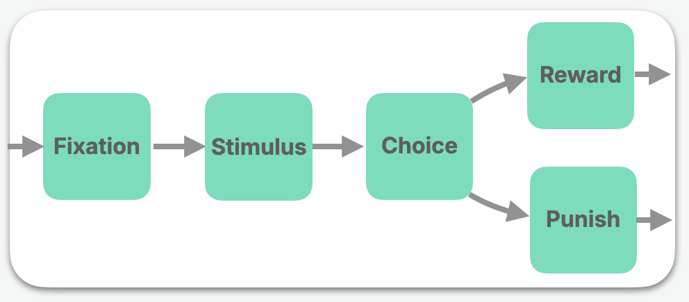

## A brief primer on NodeKit

NodeKit describes tasks as a **Graph** consisting of **Nodes** and arrows which connect them. For example, here's a task consisting of a few AFC ("alternative forced choice") trials, expressed as a Graph:


 
 

### What is a **Node**?
 
Nodes are the central object in NodeKit. It has two parts:

1. A "__Card__" that the agent views, such as an _ImageCard_, a _VideoCard_, a _TextCard_, or some simultaneous combination of those things. 
2. A "__Sensor__" which defines the particular set of __Actions__ the agent may take, such as a set of keypresses, a set of slider values, or even the set of all text strings under length `n`. 

A Node is completed when the agent makes a selection from the Action set.

### What is a **Graph**?

A Graph is a set of Nodes, and the "arrows" that connect them together. Specifically, a Graph has: 

1. A set of Nodes. 
2. A set of **Transitions** (the arrows) between those Nodes.
3. A designated **start** Node.

One can imagine "dropping" an agent onto the start Node, then seeing the agent move around different Nodes as it performs Actions and follows Transition arrows. Of course, this does not go on forever – a Graph is completed when the Agent reaches a special  **End** Transition.


## Write your first task

In NodeKit, writing a task means writing a Graph. This tutorial will walk through how to write the simplest possible Graph, which is a Graph consisting of a single Node.  

### Writing a Node 

After installing NodeKit, one begins by importing `nodekit`, which is conventionally done as:

```python hl_lines="1" linenums="1"
import nodekit as nk
```

Next, a Node can be assembled. This Node's **Stimulus** is a piece of text. The **Sensor** is the **KeySensor**, which is configured to listen for the `f` keypress and `j` keypress.

```python hl_lines="3-6" linenums="1"
import nodekit as nk 

node = nk.Node(
    stimulus=nk.cards.TextCard(text="Hello world! Press f or j to continue."),
    sensor=nk.sensors.KeySensor(keys=['f', 'j'])
)
```

### Writing a Graph

Now that a Node is written, we can assemble a Graph. 
The Graph will have a single Node, which we will name `my-first-node`. As there is no other choice, `my-first-node` will also be the designated **start** Node of the Graph. Moreover, once the agent completes this Node, the Graph will end, as `my-first-node`'s associated Transition is the **End** transition. 

```python hl_lines="8-16" linenums="1"
import nodekit as nk 

node = nk.Node(
    stimulus=nk.cards.TextCard(text="Hello world! Press f or j to continue."),
    sensor=nk.sensors.KeySensor(keys=['f', 'j'])
)

graph = nk.Graph(
    start='my-first-node',
    nodes={'my-first-node': node},
    transitions={'my-first-node': nk.transitions.End()},
)
```

## Play your task

Now it's time to play the Graph. NodeKit offers the `nk.play` function which launches your Graph on your local web browser. There is no special configuration required; just call `nk.play(graph)`:

```python hl_lines="14-20" linenums="1"
import nodekit as nk 

node = nk.Node(
    stimulus=nk.cards.TextCard(text="Hello world! Press f or j to continue."),
    sensor=nk.sensors.KeySensor(keys=['f', 'j'])
)

graph = nk.Graph(
    start='my-first-node',
    nodes={'my-first-node': node},
    transitions={'my-first-node': nk.transitions.End()},
)

trace = nk.play(graph) # launch a local server
```

You should see your Python output print out a link, which you can open up in your web browser to play the Graph. 

Once you complete the Graph's (one and only) Node, the function returns with your **Trace** through that Graph.


## Next up

We wrote a very simple Graph consisting of a single Node with an **End** Transition. 

Next up, we will write a more realistic Graph that describes a series of N-way classification trials. This Graph will showcase the rest of the Card, Sensor, and Transition types that you'll be using with NodeKit. You'll also learn about the useful `nk.concat` function.


