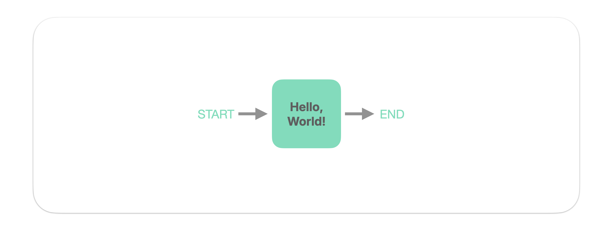

In NodeKit, a behavioral task is described using a data structure called a **Graph**. 

A **Graph** consists of a set of **Nodes** and the **Transition** arrows that connect them. For example, here's a Graph consisting of a single alternative-forced choice trial with feedback:


 Perhaps you can imagine "dropping" an agent onto the **Start** of that Graph, then seeing the agent walk from node-to-node through the Graph. Of course, this does not go on forever – a Graph is completed when the agent reaches the  **End**.

???+ question "What do you mean by "agent"?"
    In NodeKit, we use the slightly impersonal term "agent" to refer to the entity that interacts with the Graph, whether it is a person or an artificial model. The Graph works in either case!
 
In this tutorial, we will be writing a very simple Graph, consisting of a single Node:




### Step 1: Import NodeKit


After installing NodeKit in your virtual environment, start your favorite Python editor and open a new `.py` file. Then, import `nodekit`. This is conventionally done with the following line:

```python hl_lines="1" linenums="1"
import nodekit as nk
```

We're now ready to proceed! No other `import` lines are needed to use all of NodeKit. 

### Step 2: Write a Node 

We will be writing a Graph consisting of a single Node. But what exactly _is_ a Node? 

A Node describes **what the agent sees** and **what actions the agent may take** at a particular point in the task. Accordingly, a Node consists of two parts:

1. A **Card** describing what the agent sees. In this tutorial, we will be using the _TextCard_.  
2. A **Sensor** describing **Actions** the agent can take. In this tutorial, we will be using the _KeySensor_, which describes a set of _KeyActions_ the agent may take. 

Let's write a Node which displays a piece of text to the agent (`Hello world!...`), and listens for the agent to press the `f` or `j` keys on the keyboard.  Add the following lines of code:

```python hl_lines="3-6" linenums="1"
import nodekit as nk

node = nk.Node(
    card=nk.cards.TextCard(text="Hello world! Press f or j to continue."),
    sensor=nk.sensors.KeySensor(keys=['f', 'j'])
)
```

And you've written your first Node! 


### Step 3: Write the Graph

Now that our first Node is written, we can assemble a Graph.

???+ question "What's a Graph, again?"

    A Graph describes a behavioral task. A Graph consists of:

    * a set of **Nodes**,
    * a set of **Transition** arrows which describe the flow of the task,
    * and a designated **start** Node.

Remember that in this tutorial, we're writing a Graph with just a single Node. Accordingly, that Node will be the **start** Node. And after that Node is completed by the agent, the Graph will **transition to the End**.  

Now let's actually write the Graph. Add the following lines of code:

```python hl_lines="8-16" linenums="1"
import nodekit as nk

node = nk.Node(
    card=nk.cards.TextCard(text="Hello world! Press f or j to continue."),
    sensor=nk.sensors.KeySensor(keys=['f', 'j'])
)

graph = nk.Graph(
    start='my-first-node',
    nodes={'my-first-node': node},
    transitions={'my-first-node': nk.transitions.End()},
)
```

And you've written your first Graph in NodeKit! 


???+ info "Assigning IDs to Nodes in the Graph"
    Notice we assigned an ID of `my-first-node` to our one (and only) Node. We could have used any other string; the Graph would have behaved identically.   


## Step 4: Play the Graph

Now it's time to see the Graph in action by playing it in your web browser. 

To do this, we'll call the `nk.play` function, which accepts a Graph and launches it on your localhost. There is no special setup or configuration required. Just call `nk.play(graph)`:

```python hl_lines="14-20" linenums="1"
import nodekit as nk

node = nk.Node(
    card=nk.cards.TextCard(text="Hello world! Press f or j to continue."),
    sensor=nk.sensors.KeySensor(keys=['f', 'j'])
)

graph = nk.Graph(
    start='my-first-node',
    nodes={'my-first-node': node},
    transitions={'my-first-node': nk.transitions.End()},
)

trace = nk.play(graph)  # launch a local server
```


Now, **run the Python script**. You should see your standard output print out a link, which you can open up in your web browser to play the Graph. 

Once you complete the Graph's (one and only) Node, the function returns with the behavioral data you generated across your play of the Graph, and assigns it to the variable `trace`. 


## Summary

In this tutorial, you wrote, then played, your first Graph. The workflow we followed in this tutorial is typical of how one works with NodeKit, in general: 

1. Define a set of **Nodes**.
2. Wire those Nodes together into a **Graph**.
3. Deploy that Graph and **get behavior** from agent(s).

**At a conceptual level, these three bullet points are all there is to working with NodeKit.** The next tutorials will teach you deeper ways of performing each of these basic bullet points, such as showcasing more Cards & Sensors,  Transitions, and ways to deploy Graphs. 


## What's next?

In the next tutorial, we will write a Graph that describes a "real task". This Graph will show the agent some nicely-formatted text instructions, then a series of image classification trials with feedback. 

Along the way, you'll be exposed to the rest of the Card, Sensor, and Transition types. 


