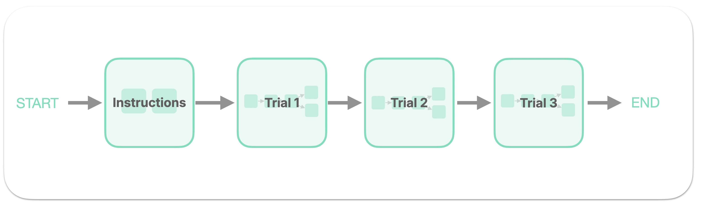
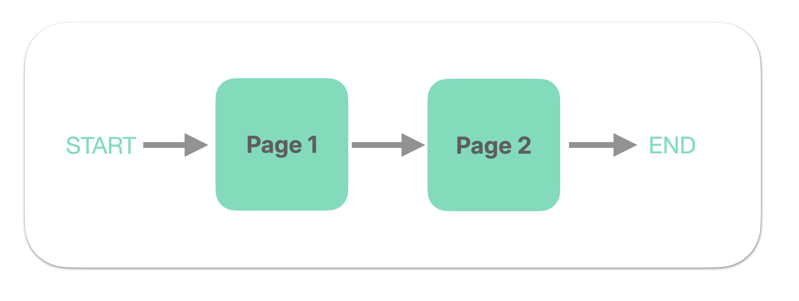
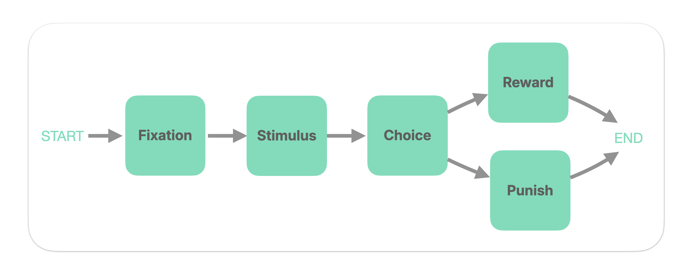

??? tip "Do the previous tutorial first!"
    This tutorial assumes you completed the [previous tutorial](2-first-graph.md), which gives an overview of Graphs, Nodes, and Transitions.


In this tutorial, we will write a Graph that describes a "real" behavioral task, with instructions and classification trials. 

Along the way, you'll get exposed to more features of NodeKit. By the end, you'll have written a Graph that looks like this: 



???+ question "Why does this Graph look different?"
    In the picture above, one can notice something new: a _Graph made up of Graphs_. This enables one to write a Graph _hierarchically_, using smaller organizational units of one's choosing (such as "trials" and "blocks").
    
    This new concept will be introduced later in this tutorial. 
       

## Step 1: Create instructions Graph

We'll begin by writing an "instructions Graph" which consists of two pages of instructions. At the end of this step, we'll have a Graph that looks like this: 




As in the previous tutorial, we'll start by defining a set of Nodes, then wiring them together into the Graph. 


### Define instruction Nodes

First, add the following code to write the first page of instructions:

```python hl_lines="1-16" linenums="1" 
import nodekit as nk 

instructions_page_1 = nk.Node(
    card=nk.cards.TextCard(
        text=("# Welcome!"
              "\n\n"
              "This is the first page of the instructions. "
              "Press the right arrow key to continue."),
        justification_horizontal='left',
    ), 
    sensor=nk.sensors.KeySensor(
        keys=['ArrowRight']
    ),
    board_color='#ffffffff', # white background
)
```

Notice we are setting the `justification_horizontal` field in the `TextCard` to `left`. In general, the TextCard has many default parameters which may be overridden to customize the appearance of the TextCard. 

???+ tip "TextCards accept Markdown syntax"

    You might have noticed we used [Markdown formatting](https://www.markdownguide.org/basic-syntax/) in the `text` field of the TextCard. Here, we wrote `# Welcome!` to define a header element.

    In NodeKit, **TextCards accept Markdown syntax.** This allows one to easily bold and italicize text, create lists, and more. 


???+ tip "Coloring the background of the Node"

    You might have also noticed we set the `board_color` parameter of the Node. By default, the background color in NodeKit is gray. Here, we've changed it to white. 

    NodeKit uses [8 digit hex encoding](https://en.wikipedia.org/wiki/Web_colors#Hex_triplet) of colors, which enables one to specify (R, G, B, A).


Now let's write the second page of instructions, which will be another Node that looks quite similar to the first one. 
 
```python hl_lines="16-29" linenums="1" 
import nodekit as nk

instructions_page_1 = nk.Node(
    card=nk.cards.TextCard(
        text=("# Welcome!"
              "\n\n"
              "This is the first page of the instructions. "
              "Press the right arrow key to continue."),
        justification_horizontal='left',
    ),
    sensor=nk.sensors.KeySensor(
        keys=['ArrowRight']
    ), 
    board_color='#ffffffff', # white
)

instructions_page_2 = nk.Node(
    card=nk.cards.TextCard(
        text=("This is the **second** page. "
              "Press the right arrow key to continue."),
        font_size=20, 
        justification_horizontal='left',
    ), 
    sensor=nk.sensors.KeySensor(
        keys=['ArrowRight']
    ),
    board_color='#ffffffff', # white background
)
```


### Wire Nodes together into the instruction Graph
Now it's time to "wire" these two Nodes together into a Graph. Add the following lines of code:

```python hl_lines="30-40" linenums="1" 
import nodekit as nk

instructions_page_1 = nk.Node(
    card=nk.cards.TextCard(
        text=("# Welcome!"
              "\n\n"
              "This is the first page of the instructions. "
              "Press the right arrow key to continue."),
        justification_horizontal='left',
    ),
    sensor=nk.sensors.KeySensor(
        keys=['ArrowRight']
    ),
    board_color='#ffffffff', # white background
)

instructions_page_2 = nk.Node(
    card=nk.cards.TextCard(
        text=("This is the **second** page. "
              "Press the right arrow key to continue."),
        font_size=20, 
        justification_horizontal='left',
    ), 
    sensor=nk.sensors.KeySensor(
        keys=['ArrowRight']
    ),
    board_color='#ffffffff', # white background
)

instructions_graph = nk.Graph(
    start='page1',
    nodes={
        'page1': instructions_page_1, 
        'page2': instructions_page_2,
    },
    transitions={
        'page1': nk.transitions.Go(to='page2'),
        'page2': nk.transitions.End()
    }
)
```

As in the previous tutorial, we assigned an ID to each Node (`page1` and `page2`). Naturally, we have the Graph *start* on `page1`. You might also recognize the **End Transition**, which declares the Graph will end after the agent takes an Action in `page2`.

But we have not seen this new **Go Transition**, which is attached to `page1`. The Go Transition here means: after the agent takes an Action in `page1`, **_go to_** `page2`.


We're now done with the instructions Graph. If you'd like, try calling `nk.play` on the instructions Graph to inspect how it looks.


## Step 2: Write the AFC Graphs

Let's now turn our attention to writing an alternative forced choice ("AFC") image classification trial. A single trial has a Graph which looks like this:



In plain words, this Graph proceeds through the following phases: 

1. **Fixation:** Showing the agent a fixation point which they must click
2. **Stimulus:** Showing the agent a stimulus for a fixed duration of time
3. **Choice:** Showing the agent an array of choices, of which the agent must choose 1
4. **Feedback**: Delivering a "reward" **OR** "punish" screen, based on some notion of correctness


### Define AFC Nodes
Begin by picking image files. They should be SVG, PNG, or JPEG; NodeKit does not support other image formats.

We'll assume you have four images on disk: a fixation image (`fixation.png`), a stimulus image (`stimulus.png`), and two choice images (`choice-correct.png` and `choice-incorrect.png`). 

In the choice Node, we will put the correct choice on the left side of the screen.

Start by defining a few sizes and durations:

```python hl_lines="1-7" linenums="1"
import nodekit as nk

fixation_size = 60
stimulus_size = 350
choice_size = 250
stimulus_duration_msec = 500
feedback_duration_msec = 600
```

Now define the Nodes for fixation, stimulus, choice, and feedback:

```python hl_lines="9-56" linenums="1"
import nodekit as nk

fixation_size = 60
stimulus_size = 350
choice_size = 250
stimulus_duration_msec = 500
feedback_duration_msec = 600

fixation_card = nk.cards.ImageCard(
    image=nk.assets.Image.from_path("fixation.png"),
    region=nk.Region(x=0, y=0, w=fixation_size, h=fixation_size),
)

fixation_node = nk.Node(
    sensor=nk.sensors.SelectSensor(choices={"fixation": fixation_card}),
)

stimulus_node = nk.Node(
    card=nk.cards.ImageCard(
        image=nk.assets.Image.from_path("stimulus.png"),
        region=nk.Region(x=0, y=0, w=stimulus_size, h=stimulus_size),
    ),
    sensor=nk.sensors.WaitSensor(duration_msec=stimulus_duration_msec),
    hide_pointer=True,
)

choice_cards = {
    "left": nk.cards.ImageCard(
        image=nk.assets.Image.from_path("choice-correct.png"),
        region=nk.Region(x=-200, y=0, w=choice_size, h=choice_size),
    ),
    "right": nk.cards.ImageCard(
        image=nk.assets.Image.from_path("choice-incorrect.png"),
        region=nk.Region(x=200, y=0, w=choice_size, h=choice_size),
    ),
}

choice_node = nk.Node(
    sensor=nk.sensors.SelectSensor(choices=choice_cards),
)

reward_node = nk.Node(
    card=nk.cards.TextCard(
        text="Correct!",
        font_size=48,
    ),
    sensor=nk.sensors.WaitSensor(duration_msec=feedback_duration_msec),
)

punish_node = nk.Node(
    card=nk.cards.TextCard(
        text="Incorrect.",
        font_size=48,
    ),
    sensor=nk.sensors.WaitSensor(duration_msec=feedback_duration_msec),
)
```

Notice that we use a `SelectSensor` for both the fixation and choice Nodes. The clickable Cards live inside the Sensor's `choices` dict, so the Node's `card` field can remain empty. 

Notice here that, for the first time, we are customizing the location of a Card by setting the `region` property. 

???+ info "The NodeKit Board coordinate system"
    In NodeKit, a 1024 x 768 pixel display is used, which is referred to as the **Board**. 
    Locations on the Board are described using a standardized coordinate system where `(0, 0)` is the center of the screen, positive `x` moves right, and positive `y` moves up.

    A Board unit of 1 means 1 CSS pixel.


???+ tip "Choice IDs become Actions"
    A `SelectSensor` emits a `SelectAction` whose `action_value` is the key you used in the `choices` dict (here, `"left"` or `"right"`). We'll use that in the next section to determine correctness.


### Wire Nodes together into the AFC Graph

In the previous step, we wrote several nodes. Now, we'll wire them together into a Graph which describes a single AFC trial. To keep things clearer, only the new code will be shown:

```python
import nodekit as nk
... # old code hidden
afc_graph = nk.Graph(
    start='fixation',
    nodes={
        'fixation': fixation_node,
        'stimulus': stimulus_node,
        'choice': choice_node,
        'reward': reward_node,
        'punish': punish_node,
    },
    transitions={
        'fixation': nk.transitions.Go(to='stimulus'),
        'stimulus': nk.transitions.Go(to='choice'),
        'choice': nk.transitions.IfThenElse(
            if_=nk.expressions.Eq(
                lhs=nk.expressions.LastAction(), 
                rhs=nk.expressions.Lit(value='left')
            ), 
            then=nk.transitions.Go(to='reward'), 
            else_ = nk.transitions.Go(to='punish')
        ),
        'reward': nk.transitions.End(),
        'punish': nk.transitions.End(),
    },
)


```


???+ tip "The IfThenElse Transition, Expressions, and Values"
    Notice we used the new **IfThenElse Transition**. In NodeKit, this is how one creates branches in Graphs. 

    You can also see that the `if_` field requires a wholly new type of NodeKit entity: the **Expression**. An Expression describes a computation which can be _evaluated_ to a **Value**. 

    Here, we wrote an Expression that is roughly equivalent to the following Python code: `last_action == 'left'`, where `last_action` is the value of the Action in the `choice` Node. When the Graph is actually run, and this Expression is encountered, it will _evaluate_ to a boolean. 

    Remember that the correct choice was assigned the ID `left`, so we have the agent should go to the `reward` Node if they chose `left`. 


### Create multiple AFC trials

In the previous steps, we wrote a single AFC trial. In this tutorial, we want to generate multiple AFC trials which differ by the image stimuli that are used. 

While we could certainly copy-and-paste the previous code two times, and edit the existing image stimulus path each time, that would make our code difficult to understand, change, and maintain.  

Thus, we should now adapt our existing code by turning it into a little "factory function" which returns an AFC Graph.  


```python linenums="1"
from pathlib import Path 
import nodekit as nk 

def generate_afc_graph(
        fixation_image_path: Path,
        stimulus_image_path: Path,
        correct_image_path: Path,
        incorrect_image_path: Path, 
        correct_on_left: bool,
) -> nk.Graph:
    # Code not shown here. 
    # Sorry, I'll add it in later!
    # But hopefully you get the idea I'm driving at here.
    # - @himjl
    ...

```


???+ info "What to expect when working with NodeKit"
    At this point in the tutorial, you might fairly conclude that much of working with NodeKit will involve writing factory functions that return Graphs.
    
    This is because NodeKit does not offer a library of ready-to-go tasks or "trial types". Instead, its focus is in providing a set of low-level "building blocks" that the user may compose into tasks. 
    
    By way of analogy, the NumPy library does not offer a library of ready-to-go linear classifiers; instead, its focus is on providing low-level building blocks (e.g. matrices + matrix operations) that the user can use.

## Step 3: Make a Graph of Graphs 

At this point in the tutorial, we've created an "instructions Graph" and three "AFC Graphs". It's now time to assemble our task by "gluing together" these Graphs together into a sequence.

So far, we've seen Graphs made of Nodes. In NodeKit, **Graphs can also be made of other Graphs.** We will use this fact to 'glue' together these Graphs into a sort-of mega Graph whose nodes are themselves Graphs: 


The syntax for doing this is exactly the same as before:

```python linenums="1"
import nodekit as nk 

... # definitions of child graphs go here

graph = nk.Graph(
    start='instructions',
    nodes={
        'instructions': instructions_graph,
        'trial1': afc_graph1,
        'trial2': afc_graph2,
        'trial3': afc_graph3,
    }, 
    transitions={
        'instructions': nk.transitions.Go(to='trial1'),
        'trial1': nk.transitions.Go(to='trial2'),
        'trial2': nk.transitions.Go(to='trial3'),
        'trial3': nk.transitions.End(), 
    }
)
```

???+ info "Nested Graphs are optional"
    Writing Graphs using other Graphs is nice, because it allows one to hierarchically organize their task code. This makes one's code easier to write and understand.

    But notice this is completely optional: perhaps you can imagine that we could have written this Graph in a totally 'flat' style.  

???+ tip "Save time by using `nk.concat`"

    Many tasks can be described by _linear_ Graphs, where Nodes (or child Graphs) occur one after the other. 

    To avoid writing `Go` boilerplate, we can use the useful `nk.concat` function. 

    We could have written the same exact Graph above using the following: 

    ```python linenums="1" hl_lines="5-8"
    import nodekit as nk
    
    ... # definitions of child graphs go here
    
    graph = nk.concat(
        sequence=[instructions_graph, afc_graph1, afc_graph2, afc_graph3], 
        ids = ['instructions', 'trial1', 'trial2', 'trial3']
    )
    
    ```


## Summary

This tutorial introduced several new NodeKit features: 

- **Graph nesting,** where Graph can be composed of other Graphs, 
- The standardized **Board coordinate system**,
- New Card and Sensor types: particularly the **ImageCard** and the **SelectSensor**,
- **Control flow** in Graphs, via the _Go_ and _IfThenElse_ Transitions,
- The use of **Expressions** to configure the _IfThenElse_ Transition,
- And the **`nk.concat` function**, which is a time-saving convenience method for 'gluing' together Graphs (and Nodes) into a linear Graph.

With the above, one can now describe many types of behavioral tasks used in psychological and behavioral research.     

## What's next?

Up until now, you have been "deploying" Graphs to your local system by using the `nk.play` function. But NodeKit offers two other deployment schemes:   

1. Simulating Graphs in Python (for models)
2. Building deployable static websites for Mechanical Turk or Prolific

These are covered in the next, and final, tutorial.

