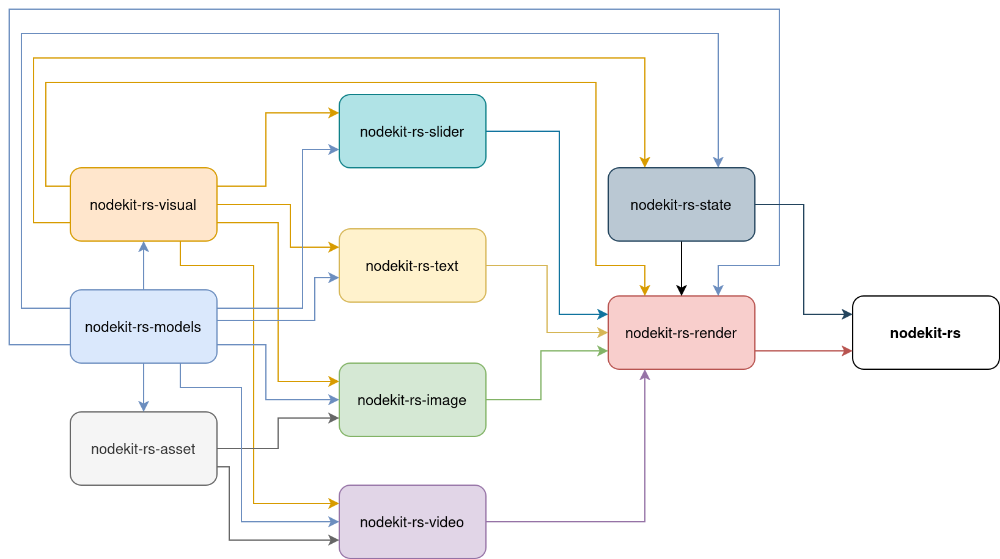

# nodekit-rs

## Setup

1. [Install Rust](https://rust-lang.org/tools/install/)
2. Activate Python venv
3. [Install `cargo-vcpkg`](https://github.com/mcgoo/cargo-vcpkg?tab=readme-ov-file#installation)
4. `cd nodekit-rs-video && cargo vcpkg build`
5. `./develop.sh`

The first time you run steps 4 and 5 they will take a while; subsequent executions will be much faster because they'll use cached data.

Steps 4 and 5 require approximately 37 GB of disk space, nearly all of which is cached data. You can free up that space by running `cargo clean`, but then steps 4. and 5. will be slow the next time you run them.

The size of the final `.whl` file should be approximately 44 MB.

## Usage

### Render

```python
from nodekit_rs import Renderer, State

card = get_card()  # Your code here. Can be a CompositeCard.
state = State(board_color="#AAAAAAFF", card=card)

renderer = Renderer()
board = renderer.render(state)
```

`board` is a numpy array of an RGB24 bitmap. Data type is `np.uint8`. Shape is `(1024, 1024, 3)`.

### Render in-place

You can, optionally, render to an existing numpy array, which will result in a small performance improvement:

```python
from nodekit_rs import Renderer, State

card = get_card()
state = State(board_color="#AAAAAAFF", card=card)

renderer = Renderer()

board = renderer.empty_board()  # Get an empty board (a numpy array).

for i in range(100):
    renderer.render_to(state, board)  # Render into the pre-allocated `board`.
```

### Stateful information

To set the pointer position, call `state.set_pointer(x, y)` where `x` and `y` are ints between -512 and 512:

```python
from nodekit_rs import State

card = get_card()
state = State(board_color="#AAAAAAFF", card=card)
state.set_pointer(0, 0)
```

If there are video cards, you will need to manually set the current time, in milliseconds:

```python
from nodekit_rs import State

card = get_card()
state = State(board_color="#AAAAAAFF", card=card)
state.t_msec = 300
```

## What works, what doesn't

**`nodekit-rs` is in alpha.** The goal is to faithfully replicate `nodekit-browser`. In some cases, the replication isn't exact. In other cases, features are missing.

ImageCard, VideoCard, and CompositeCard card should always look the same as they would in a browser.

TextCard is WIP. Markdown formatting is supported. Colorized words are supported (but not in `nodekit-browser`). There are differences in line heights and font weights. There are minor kerning problems with list items.

Pointer rendering is supported but might not be the same as in the browser.

Sensors are not yet implemented.

## Test

Run unit tests:

```bash
cargo test --all
```

Python tests are in `py-examples/`. Run `multiframe.py` and `node_test.py` and view the output.

## Benchmark

Run Rust benchmarks:

```bash
cargo bench --all
```

Run Python-to-Rust test:

```bash
cd py_examples
python benchmark.py
```

## Architecture

