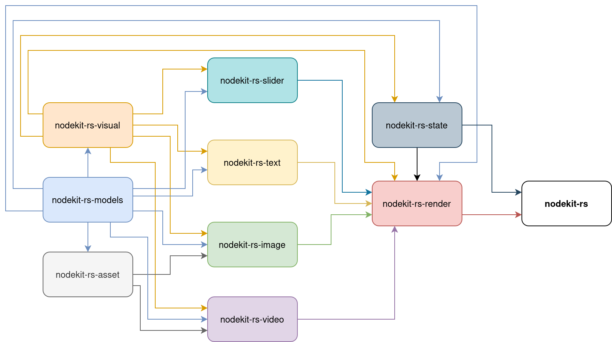

# nodekit-rs

## Setup

1. [Install Rust](https://rust-lang.org/tools/install/)
2. [Install uv](https://docs.astral.sh/uv/)
3. Activate Python venv
4. In the root directory of `nodekit`, run one of the following:
   ```sh
   # Install nodekit and nodekit-rs
   make build
   ```
   or
   ```sh
   # Install nodekit-rs
   make build-rs
   ```
   
### Why `make build-rs` is so slow

The first time you install `nodekit-rs`, it will take a long time (a few minutes on MacOS and Linux, longer on Windows) and generate approximately 5.5 GB of cached build artifacts in the `target/` directory. Subsequent reinstalls of `nodekit-rs` will be much faster.

You can remove the cached build artifacts by running:

```sh
cd nodekit-rs
cargo clean
```

...but then the next reinstall will take just as much time as the first install.

The compiled library file is *much* smaller than the build artifacts (approximately 44 MB) and is located in your venv.

### Update `nodekit-rs`

Any time you make changes to `nodekit-rs`, you must rerun `make build-rs`.

If you change the Python-facing API, you must regenerate `nodekit_rs.pyi` by running:

```sh
make nodekit-rs-stub-gen
```

## Usage

### Render

```python
import nodekit as nk

card = get_card()  # Your code here. Can be a CompositeCard.
sensor = get_sensor()  # Your code here.

state = nk.experimental.renderer.State(
    board_color="#AAAAAAFF",
    card=card, 
    sensor=sensor
)

renderer = nk.experimental.renderer.Renderer()
board = renderer.render(state)
```

`board` is a numpy array of an RGB24 bitmap. Data type is `np.uint8`. Shape is `(1024, 1024, 3)`.

### Render in-place

You can, optionally, render to an existing numpy array, which will result in a small performance improvement:

```python
import nodekit as nk

card = get_card()
sensor = get_sensor()
state = nk.experimental.renderer.State(
    board_color="#AAAAAAFF",
    card=card, 
    sensor=sensor
)

renderer = nk.experimental.renderer.Renderer()

board = renderer.empty_board()  # Get an empty board (a numpy array).

for i in range(100):
    renderer.render_to(state, board)  # Render into the pre-allocated `board`.
```

### Pointer position

To set the pointer position, call `state.set_pointer(x, y)` where `x` and `y` are ints between -512 and 512:

```python
import nodekit as nk

card = get_card()  # Your code here. Can be a CompositeCard.
sensor = get_sensor()  # Your code here.
state = nk.experimental.renderer.State(
    board_color="#AAAAAAFF",
    card=card, 
    sensor=sensor
)
state.set_pointer(0, -100)
```

### Video seeking

If there are video cards, you will need to manually set the current time, in milliseconds:

```python
import nodekit as nk

card = get_card()  # Your code here. Can be a CompositeCard.
sensor = get_sensor()  # Your code here.
state = nk.experimental.renderer.State(
    board_color="#AAAAAAFF",
    card=card,
    sensor=sensor
)
state.t_msec = 300
```

### Sensors

`nodekit-rs` will accept any sensor type, but will fail silently for most of them.

For example, this is valid code:

```python
import nodekit as nk

card = get_card()  # Your code here. Can be a CompositeCard.
sensor = nk.sensors.WaitSensor(duration_msec=10000)

state = nk.experimental.renderer.State(
    board_color="#AAAAAAFF",
    card=card,
    sensor=sensor
)
state.t_msec = 300

renderer = nk.experimental.renderer.Renderer()
board = renderer.render(state)
```

`nodekit-rs` currently supports graphical renderings of:

- `SelectSensor`
- `MultiSelectSensor`

#### Hovering

To graphically render cards that are being hovered over, set the sensor as `SelectSensor` or `MultiSelectSensor` and then call `state.hover(choice)`.

`nodekit-rs` will not check the actual position of the pointer.

```python
import nodekit as nk

card = get_card()  # Your code here.
sensor = nk.sensors.SelectSensor(choices={
    'a': get_another_card()  # Your code here.
})
state = nk.experimental.renderer.State(
    board_color="#AAAAAAFF", 
    card=card,
    sensor=sensor
)
state.hover('a')
```

To stop rendering any hovering overlays, call `state.hover(None)`

#### Selecting

To graphically render a selected card, set the sensor as a `MultiSelectSensor` and call `state.set_selection(choice, select)` where `choice` is a valid key in `MultiSelectSensor.choices` and `select` is a boolean that will (de)select the card(s).

If you call `state.select(choice, select)` and the sensor is a `SelectSensor`, the call will fail silently. All other sensor types will throw an exception.

## What works, what doesn't

**`nodekit-rs` is in alpha.** The goal is to faithfully replicate `nodekit-browser`. In some cases, the replication isn't exact. In other cases, features are missing. Notable examples:

- ProductSensor
- SumSensor

## Test

Run unit tests:

```bash
cd nodekit-rs
cargo test --all
```

Python tests are in `py-examples/`. Run `multiframe.py` and `node_test.py` and view the output.

## Benchmark

Run Rust benchmarks:

```bash
cd nodekit-rs
cargo bench --all
```

Run Python-to-Rust test:

```bash
cd nodekit-rs/py-examples
python benchmark.py
```

## Architecture



`nodekit-rs` has been organized according to best practices when developing in Rust:

- Use multiple crates to utilize Rust's scoping protections and to reduce compile time
- Isolate the portions of the code that are callable from Python or that extract Python data

As shown in the vertical columns of the diagram, there are four "levels" of `nodekit-rs`.

- "Low-level" crates, used throughout `nodekit-rs`:
  - `nodekit-rs-models` extracts `nodekit` Python models into `nodekit-rs` structs
  - `nodekit-rs-visual` stores and converts raw bitmap data
  - `nodekit-rs-asset` loads assets from a paths or URLs
- "Asset-level" crates:
  - `nodekit-rs-image` renders ImageCard
  - `nodekit-rs-slider` renders SliderSensor
  - `nodekit-rs-text` renders TextCard and TextEntrySensor
  - `nodekit-rs-video` renders VideoCard
- "Render-level" crates:
  - `nodekit-rs-render` renders all cards and sensors, and stores cached asset data
  - `nodekit-rs-state` stores all information extracted from `nodekit` models as stateful, modifiable, data
- "Python-level" crate that defines the Rust-Python interface:
  - `nodekit-rs` re-exports `Renderer` and `State`

An additional crate, `nodekit-rs-png`, can write png files from bitmaps. It is only used when running `cargo test`